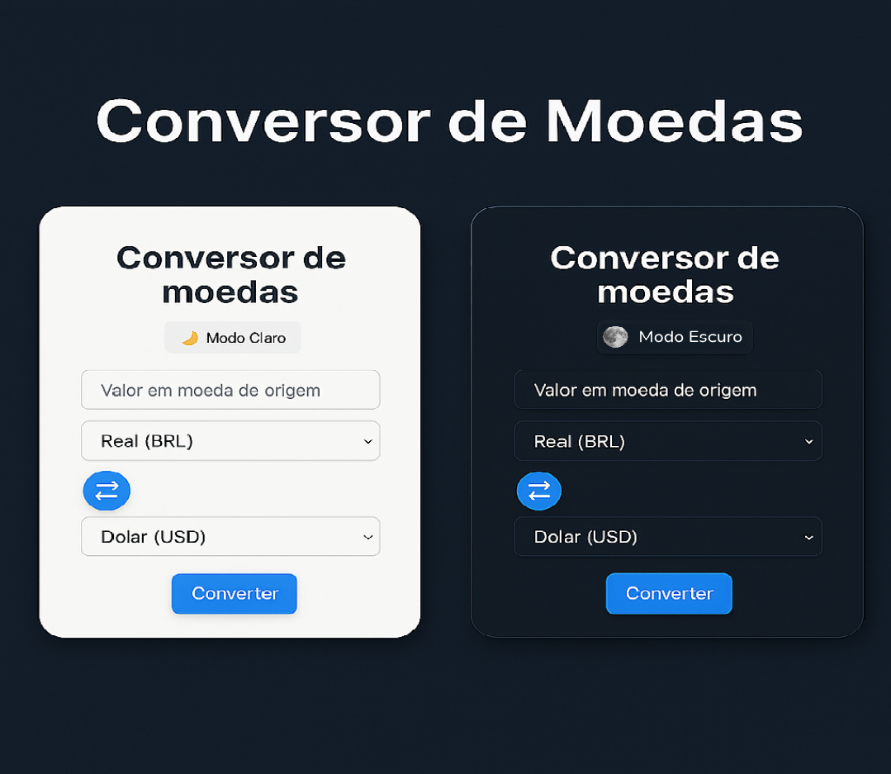

<p align="center">
<<<<<<< HEAD
  
=======
  <a href="https://yovisck-c.github.io/conversor_de_moedas/" target="_blank">
    
  </a>
  <a href="./CHANGELOG.md" target="_blank">
    
  </a>
>>>>>>> 67ccf7d (batches para o README :D)
</p>

<h1 align="center">💱 Conversor de Moedas</h1>

<p align="center">
<<<<<<< HEAD
  <a href="https://yovisck-c.github.io/conversor_de_moedas/">🔗 Projeto Online</a> • 
  <a href="./CHANGELOG.md">📝 Changelog</a> • 
  
  
  
=======
  
  
  
>>>>>>> 67ccf7d (batches para o README :D)
</p>


---

## 🚀 Objetivo

Este projeto foi criado como parte do meu processo de estudos em **desenvolvimento front-end**, com o intuito de:

- Explorar **requisições HTTP** com `async/await`
- Trabalhar com **validação de formulários**
- Criar interações úteis com **JavaScript Vanilla (sem frameworks)**
- Aprimorar o visual e usabilidade de interfaces

---

## ✨ Funcionalidades

- Conversão entre moedas (BRL, USD, EUR)
- Integração com API pública de câmbio em tempo real ([open.er-api.com](https://www.exchangerate-api.com/))
- Botão 🔁 para inverter as moedas de forma dinâmica
- Modo claro/escuro com alternância ao clicar 🌙☀️
- Design responsivo para desktop e mobile
- Interface visual moderna com ícones e flexbox

---

## 🛠 Tecnologias utilizadas

- HTML5
- CSS3 (responsivo + modo escuro)
- JavaScript (ES6+)
- API: [open.er-api.com](https://www.exchangerate-api.com/)
- Font Awesome (ícones)

---

## 📘 Aprendizados com o projeto

- Estruturação de código em arquivos separados
- Boas práticas de acessibilidade (rótulos, contraste)
- Lógica de manipulação de dados externos (JSON)
- Criação de temas visuais e alternância dinâmica de classes
- Organização incremental usando `CHANGELOG.md`

---

## ⚙️ Como usar

Clone o repositório:

```bash
git clone https://github.com/yovisck-c/conversor_de_moedas.git
```

Depois, abra o arquivo `index.html` no navegador.

> 💡 Recomendado: use a extensão Live Server no VS Code para melhor experiência.

---

## 🌐 Projeto online

🔗 [https://yovisck-c.github.io/conversor_de_moedas/](https://yovisck-c.github.io/conversor_de_moedas/)

---

## 📌 Histórico de versões

Consulte o arquivo [`CHANGELOG.md`](./CHANGELOG.md) para ver todas as atualizações feitas até o momento.

---

## 👩‍💻 Autor

Desenvolvido por [Maria Clara Piromali Guarizo](https://github.com/yovisck-c)  
📬 [LinkedIn](https://www.linkedin.com/in/maria-clara-piromali-guarizo-6b8a21357/)

---

## 🧾 Licença

Este projeto é livre para estudo e uso pessoal. Sinta-se à vontade para contribuir, clonar ou adaptar para seus próprios testes.
